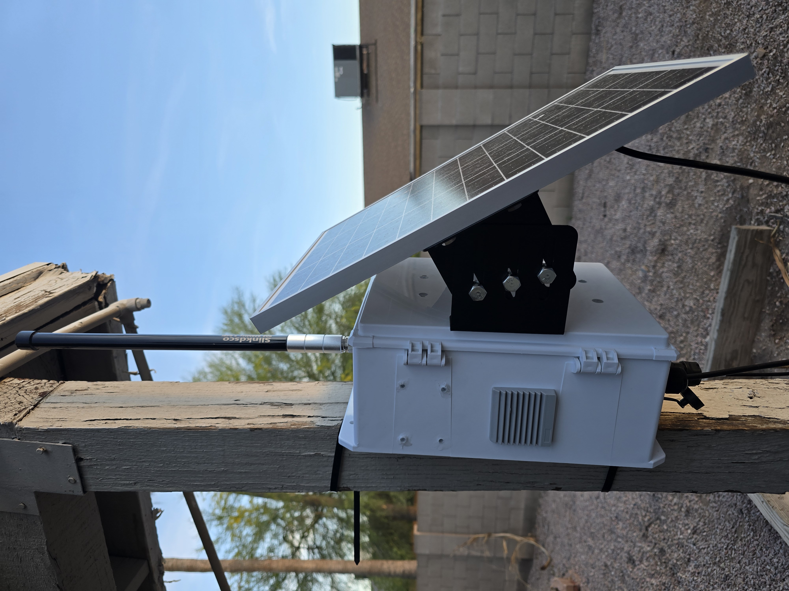

# Meshtastic Solar Node — Full Build Guide

A fully solar-powered outdoor Meshtastic node using a Raspberry Pi 5 and MeshAdv Pi Hat, with a live network statistics dashboard, GPS-disciplined NTP server, and MeshMonitor integration running on a Synology NAS.

---

## Table of Contents

1. [Hardware](#hardware)
2. [Meshtasticd Configuration](#meshtasticd-configuration)
3. [GPS & NTP Server](#gps--ntp-server)
4. [MeshMonitor Integration](#meshmonitor-integration)
5. [MeshStats Dashboard](#meshstats-dashboard)
6. [AZMSH Network](#azmsh-network)
7. [Pi System Configuration](#pi-system-configuration)

---

## Hardware

| Component | Part |
|---|---|
| SBC | Raspberry Pi 5 |
| Meshtastic Radio Hat | MeshAdv Pi Hat V1.1 (1W LoRa, E22-900M30S) |
| PoE Hat | Waveshare PoE Hat (F) — 802.3af/at |
| Solar Charge Controller | Tycon Systems TP-SCPOE1248 |
| Solar Panel | 18V 25W |
| Battery | 12V 10Ah LiFePO4 with integrated BMS |
| PoE Injector (passive) | Linovision Gigabit 90W Passive PoE Injector |
| PoE Injector (active) | PoE Texas DC-Powered PoE+ 30W (12-60V in to 802.3at out) |
| Antenna | Slinkdsco Waterproof 5.8dBi Fiberglass 915MHz N-Male |
| GPS Module | ATGM336H (onboard MeshAdv Pi Hat) |
| Router | Netgear RS700 |

### Stacking Note

When stacking the Waveshare PoE Hat beneath the MeshAdv Pi Hat, use a **2x20 tall stacking header (11mm or 15mm pin length)** to ensure GPIO pins fully seat through both PCBs. Short pins that do not make contact will silently break the GPS PPS signal on GPIO 23 and other connections.

---

## Meshtasticd Configuration

The MeshAdv Pi Hat runs [meshtasticd](https://meshtastic.org/docs/hardware/devices/linux-native-hardware/) — the Linux-native Meshtastic daemon.

### Install

```bash
sudo apt update
sudo apt install meshtasticd
```

### /etc/meshtasticd/config.yaml

```yaml
Lora:
  Module: sx1262
  CS: 21
  IRQ: 16
  Busy: 20
  Reset: 18
  TXen: 13
  RXen: 12
  DIO3_TCXO_VOLTAGE: true

GPS:
  SerialPath: /dev/ttyAMA0

I2C:
  I2CDevice: /dev/i2c-1

Logging:
  LogLevel: info

Webserver:
  Port: 443
  RootPath: /usr/share/meshtasticd/web

General:
  MaxNodes: 200
```

### MeshAdv Pi Hat GPIO Pin Mapping

| Physical Pin | GPIO | Function |
|---|---|---|
| 8 | 14 | GPS UART TX to GPS RX |
| 10 | 15 | GPS UART RX from GPS TX |
| 12 | 18 | LoRa RST |
| 16 | 23 | GPS PPS output |
| 19 | 10 | LoRa SPI MOSI |
| 21 | 9 | LoRa SPI MISO |
| 23 | 11 | LoRa SPI CLK |
| 32 | 12 | LoRa RXEN |
| 33 | 13 | LoRa TXEN |
| 36 | 16 | LoRa IRQ |
| 38 | 20 | LoRa BUSY |
| 40 | 21 | LoRa NSS |

### Radio Settings

| Setting | Value |
|---|---|
| Region | US |
| Modem Preset | MediumFast |
| Channel | 17 |
| TX Power | 22 dBm |
| Role | Client |
| Hop Limit | 3 |

### Enable and Start

```bash
sudo systemctl enable meshtasticd
sudo systemctl start meshtasticd
sudo journalctl -u meshtasticd -f
```

---

## GPS and NTP Server

The ATGM336H GPS module outputs a hardware PPS signal on GPIO 23 once it has a satellite fix. This disciplines a local NTP server to GPS time making the Pi a **Stratum 1 NTP server** with approximately 35 nanosecond accuracy.

### How It Works

```
ATGM336H GPS module
├── NMEA sentences → /dev/ttyAMA0 → gpsd → chrony SHM 0
└── PPS pulse 1Hz → GPIO 23 pin 16 → /dev/pps0 → chrony PPS refclock → NTP clients
```

### Step 1 — Enable PPS GPIO overlay

Add to /boot/firmware/config.txt:

```
dtoverlay=pps-gpio,gpiopin=23
```

Reboot and verify:

```bash
ls /dev/pps0
gpioinfo | grep "GPIO23"
# expected: consumer="pps@17"
```

### Step 2 — Install packages

```bash
sudo apt install gpsd gpsd-clients pps-tools chrony
```

### Step 3 — Configure gpsd

/etc/default/gpsd:

```
START_DAEMON="true"
USBAUTO="false"
DEVICES="/dev/ttyAMA0 /dev/pps0"
GPSD_OPTIONS="-n -b"
GPSD_SOCKET="/var/run/gpsd.sock"
```

The -b flag prevents gpsd from switching the ATGM336H into u-blox binary mode. The -n flag starts polling immediately without waiting for a client.

### Step 4 — Configure chrony

Add to the top of /etc/chrony/chrony.conf above existing pool lines:

```
refclock SHM 0 refid NMEA precision 1e-1 offset 0.0 noselect
refclock PPS /dev/pps0 refid PPS lock NMEA precision 1e-7
allow 192.168.1.0/24
```

### Step 5 — Enable services

```bash
sudo systemctl enable gpsd gpsd.socket chrony
sudo systemctl start gpsd.socket gpsd
sudo systemctl restart chrony
```

### Verify

```bash
sudo ppstest /dev/pps0
chronyc sources -v
chronyc tracking
```

Expected chronyc tracking output when fully locked:

```
Reference ID    : 50505300 (PPS)
Stratum         : 1
System time     : 0.000000035 seconds fast of NTP time
Skew            : 0.004 ppm
Root delay      : 0.000000001 seconds
```

### Point Your Router at the Pi

On Netgear RS700: Advanced → Administration → NTP Settings → Set your preferred NTP server → enter the Pi IP.

Verify from Windows:

```powershell
w32tm /stripchart /computer:YOUR_PI_IP /samples:5 /dataonly
```

### Troubleshooting

| Symptom | Cause | Fix |
|---|---|---|
| /dev/pps0 missing | Overlay not loaded | Check /boot/firmware/config.txt and reboot |
| ppstest times out | No GPS fix or broken PPS trace | Wait for fix, test pin 16 with multimeter in DC volts mode |
| chrony NMEA/PPS show ? | gpsd not running | Check systemctl status gpsd and /etc/default/gpsd |
| gpsd shows devices empty | Serial port held by another process | sudo fuser /dev/ttyAMA0 |
| gpsd in binary mode | Missing -b flag | Add -b to GPSD_OPTIONS |
| PPS claimed but no edges | Pi 5 GPIO issue | Verify gpioinfo shows consumer=pps@17 on GPIO 23 |

---

## MeshMonitor Integration

[MeshMonitor](https://github.com/Yeraze/meshmonitor) runs on a Synology NAS in Docker and connects to meshtasticd over TCP to log all packets, nodes, messages, and telemetry to a SQLite database.

### docker-compose.yml

Place at /volume1/docker/meshmonitor/docker-compose.yml:

```yaml
version: "3.8"
services:
  meshmonitor:
    image: yeraze/meshmonitor:latest
    container_name: meshmonitor
    restart: unless-stopped
    ports:
      - "8080:8080"
    volumes:
      - meshmonitor-data:/data
    environment:
      - MESHTASTIC_HOST=YOUR_PI_IP
      - MESHTASTIC_PORT=4403

volumes:
  meshmonitor-data:
```

```bash
cd /volume1/docker/meshmonitor
docker-compose up -d
```

Access at http://YOUR_NAS_IP:8080

### Database Location

```
/volume1/@docker/volumes/meshmonitor_meshmonitor-data/_data/meshmonitor.db
```

---

## MeshStats Dashboard

A live statistics dashboard that reads directly from the MeshMonitor SQLite database. Auto-refreshes every 60 seconds.

### Features

- Summary stats: total nodes, active nodes 30m and 24h, direct links, avg SNR, total packets, messages
- Nodes tab: sortable by packets, SNR, RSSI, last heard, hops with battery indicators and channel utilization badges
- Packets tab: packet type breakdown with signal quality per type
- Activity tab: hourly traffic chart last 24h local time, top nodes leaderboard, SNR health distribution
- Messages tab: recent channel messages with timestamps and sender names

### Architecture

```
MeshMonitor container NAS
└── meshmonitor.db SQLite read-only mount
    └── MeshStats API FastAPI port 8000
        └── MeshStats UI nginx port 8082
```

### Setup

Place the meshstats folder at /volume1/docker/meshstats/ on the NAS:

```bash
cd /volume1/docker/meshstats
docker-compose up -d --build
```

Access at http://YOUR_NAS_IP:8082

### docker-compose.yml

```yaml
version: "3.8"
services:
  meshstats-api:
    build: ./backend
    container_name: meshstats-api
    restart: unless-stopped
    ports:
      - "8000:8000"
    volumes:
      - /volume1/@docker/volumes/meshmonitor_meshmonitor-data/_data/meshmonitor.db:/data/meshmonitor.db:ro
    environment:
      - DB_PATH=/data/meshmonitor.db

  meshstats-ui:
    build: ./frontend
    container_name: meshstats-ui
    restart: unless-stopped
    ports:
      - "8082:80"
    depends_on:
      - meshstats-api
```

### API Endpoints

| Endpoint | Description |
|---|---|
| GET /api/stats/summary | Overall network summary |
| GET /api/stats/nodes?limit=150 | Node list with packet counts |
| GET /api/stats/packets | Packet type breakdown |
| GET /api/stats/hourly | Hourly activity last 24h |
| GET /api/stats/messages?limit=50 | Recent channel messages |
| GET /api/stats/neighbors | Neighbor relationships |
| GET /api/stats/telemetry/{node_id} | Node telemetry history |
| GET /health | Health check |

---

## AZMSH Network

This node participates in the [Arizona Meshtastic Community AZMSH](https://azmsh.net) network.

### Recommended Settings

| Setting | Value |
|---|---|
| Role | Client |
| Hop Limit | 3 |
| Node Info Broadcast | Every 4 to 6 hours |
| Position Broadcast | Every 12 to 24 hours stationary |
| Telemetry | Every 4 to 6 hours |
| MQTT Downlink | Disabled on primary channel |

---

## Pi System Configuration

### Services Running at Boot

| Service | Purpose |
|---|---|
| meshtasticd | Meshtastic radio daemon |
| gpsd | GPS daemon |
| gpsd.socket | gpsd socket activation |
| chrony | GPS-disciplined NTP server |

Enable all:

```bash
sudo systemctl enable meshtasticd gpsd gpsd.socket chrony
```

### SSH Access

```bash
ssh mesh@YOUR_PI_IP
```

Add to ~/.ssh/config:

```
Host meshpi
    HostName YOUR_PI_IP
    User mesh
```

### Power Notes

The Pi 5 displays a power supply not capable of 5A warning when powered via PoE. This is cosmetic — the Pi cannot negotiate USB-PD over PoE and logs the warning regardless of actual power delivery.

To suppress add usb_max_current_enable=1 to /boot/firmware/config.txt

Verify actual input voltage:

```bash
vcgencmd pmic_read_adc EXT5V_V
```

### Backup

```bash
sudo dd if=/dev/sdX of=meshpi-backup.img bs=4M status=progress
```

Restore with [Balena Etcher](https://etcher.balena.io/).

## Photos




---

## Pending

- [ ] Install cavity filter pending delivery
- [ ] Replace temporary GPIO pins with proper tall stacking header 2x20 11mm or longer
- [ ] Disable WiFi persistently: nmcli connection modify netplan-wlan0-NETGEAR43 connection.autoconnect no
- [ ] Pi image backup

---

## License

MIT
